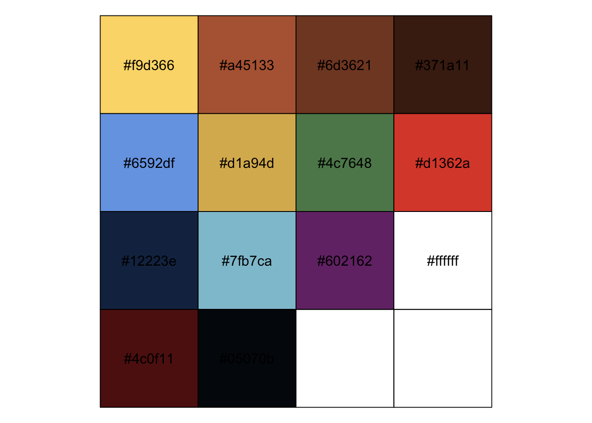
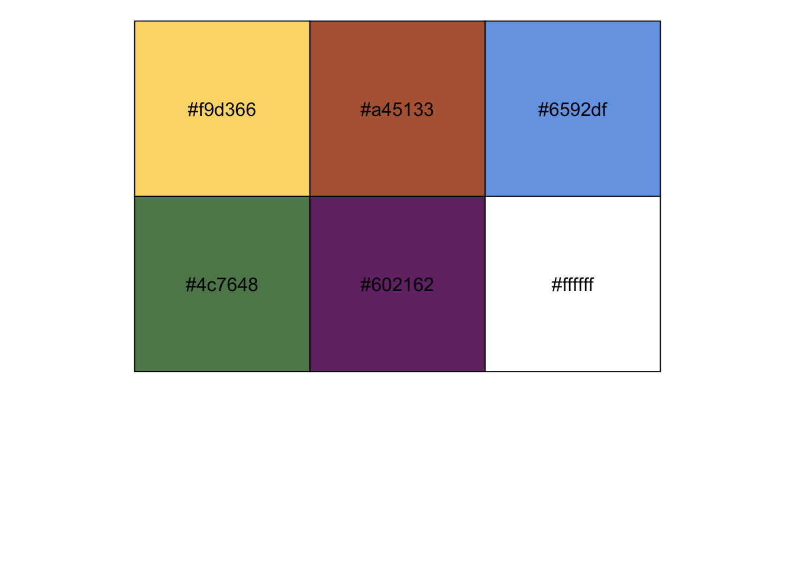
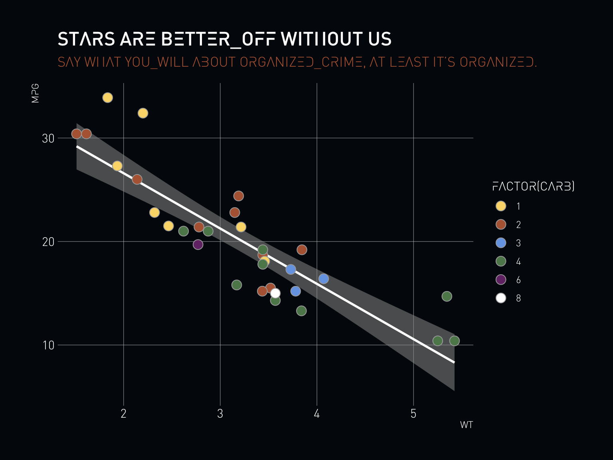

[](https://www.repostatus.org/#active)
[](https://keybase.io/hrbrmstr)

[](https://travis-ci.org/hrbrmstr/ggexpanse)  


# ggexpanse

Theme Elements Based On ‘The Expanse’

## Description

Plot aesthetic defaults and theme elements inspired by ‘The Expanse’.

## What’s Inside The Tin

A copy of the [Protomolecule
Font](https://www.reddit.com/r/TheExpanse/comments/ay322l/protomolecule_font/).

The following functions are implemented:

  - `expanse_cols`: Colors from The Expanse (WIP)
  - `expanse_pal`: Color palette based on selected colors from
    expanse\_cols
  - `import_protomolecule`: Import Protomolecule font for use in charts
  - `scale_colour_expanse`: Discrete color & fill scales based on “The
    Expanse” palette
  - `theme_expanse`: An “Expanse” theme for ggplot2

## Installation

``` r
install.packages("ggexpanse", repos = "https://cinc.rud.is")
# or
remotes::install_git("https://git.rud.is/hrbrmstr/ggexpanse.git")
# or
remotes::install_git("https://git.sr.ht/~hrbrmstr/ggexpanse")
# or
remotes::install_gitlab("hrbrmstr/ggexpanse")
# or
remotes::install_bitbucket("hrbrmstr/ggexpanse")
# or
remotes::install_github("hrbrmstr/ggexpanse")
```

NOTE: To use the ‘remotes’ install options you will need to have the
[{remotes} package](https://github.com/r-lib/remotes) installed.

## Usage

``` r
library(ggexpanse)

# current version
packageVersion("ggexpanse")
## [1] '0.1.0'
```

``` r
scales::show_col(as.character(expanse_cols))
```



``` r
scales::show_col(expanse_palette)
```



``` r
ggplot() +
  geom_smooth(
    data = mtcars, method = "lm", 
    aes(wt, mpg), colour = "white", 
    fill = "gray60", show.legend = FALSE
  ) +
  geom_point(
    data = mtcars,
    aes(wt, mpg, fill = factor(carb)), 
    shape = 21, color = "gray60", size = 4
  ) +
  scale_colour_expanse() +
  scale_fill_expanse() +
  labs(
    title = "Stars Are Better_Off Without Us",
    subtitle = "Say what you_will about organized_crime, at least it’s organized."
  ) +
  theme_expanse(grid = "XY")
```



## ggexpanse Metrics

| Lang | \# Files |  (%) | LoC |  (%) | Blank lines | (%) | \# Lines |  (%) |
| :--- | -------: | ---: | --: | ---: | ----------: | --: | -------: | ---: |
| R    |        6 | 0.86 | 199 | 0.88 |          28 | 0.6 |       72 | 0.68 |
| Rmd  |        1 | 0.14 |  28 | 0.12 |          19 | 0.4 |       34 | 0.32 |

## Code of Conduct

Please note that this project is released with a Contributor Code of
Conduct. By participating in this project you agree to abide by its
terms.
